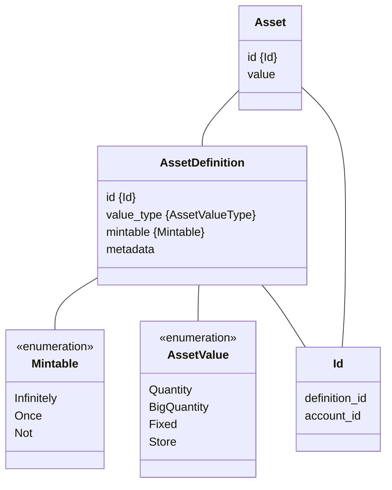

# Assets

Iroha has been built with few underlying assumptions about what the assets
need to be.

The assets can be **fungible** (every £1 is exactly the same as every other
£1) or **non-fungible** (a £1 bill signed by the Queen of Hearts is not the
same as a £1 bill signed by the King of Spades).

The assets can also be **mintable** (you can make more of them) and
**non-mintable** (you can only specify their initial quantity in the
[genesis block](/guide/configure/genesis.md)).

## Value Types

Additionally, the assets have different underlying value types.
Specifically, we have `AssetValueType.Quantity`, which is effectively an
unsigned 32-bit integer, a `BigQuantity`, which is an unsigned 128-bit
integer, and `Fixed`, which is a positive (though signed) 64-bit
fixed-precision number with nine significant digits after the decimal
point. All three types can be registered as either **mintable** or
**non-mintable**.

There is also the `Store` asset type, which is used for storing key-values
in object's metadata. We talk in detail about `Store` asset in the chapter
related to [metadata](metadata.md).

## Asset Structure

## Instructions

Assets can be [registered](./instructions.md#un-register),
[minted or burned](./instructions.md#mint-burn), and transferred.

Refer to one of the language-specific guides to walk you through the
process of registering and minting assets in a blockchain:

- [CLI](/get-started/operate-iroha-2-via-cli.md#_6-register-and-mint-assets)
- [Rust](/guide/tutorials/rust.md#_5-registering-and-minting-assets)
- [Kotlin/Java](/guide/tutorials/kotlin-java.md#_5-registering-and-minting-assets)
- [Python](/guide/tutorials/python.md#_5-registering-and-minting-assets)
- [JavaScript/TypeScript](/guide/tutorials/javascript.md#_5-registering-and-minting-assets)
