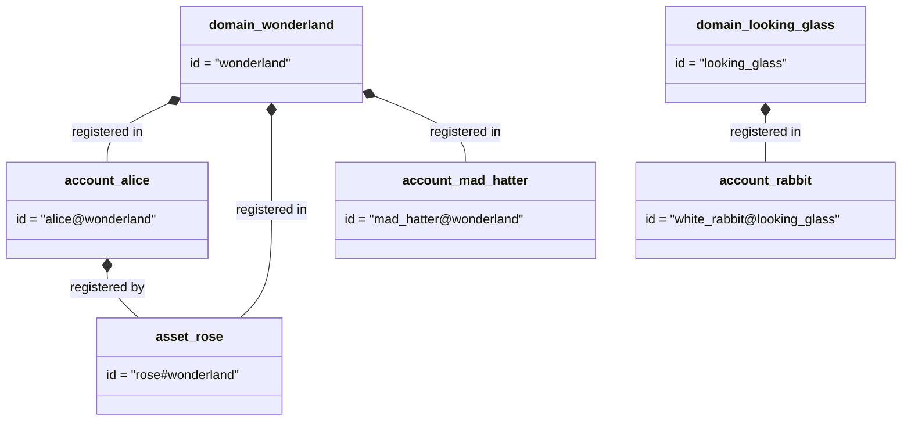
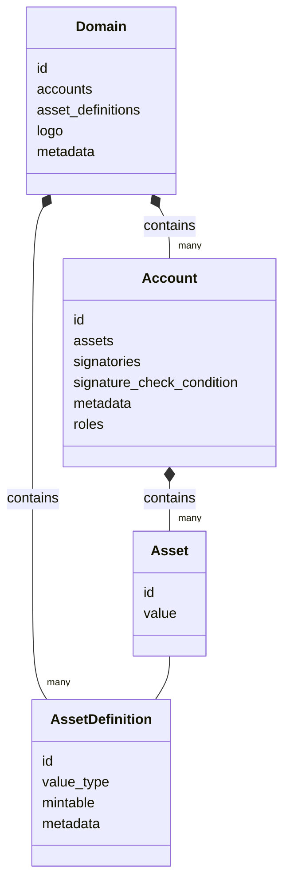

# Data Model

In language-specific guides we already walked you through registering
domains, accounts, and assets. Here we merely wish to illustrate the
relationship between various objects in the blockchain.

```

   +-----------------------------------------------+
   |                                               |
   |     +-----------------+                       |
   |     |Domain           |                       |
   |     +--------------+  |                       |
   |     ||Asset        |  |                       |
+--+--+  ||Definition(s)|  |                       |
|World|  +--------------+  |                       |
+--+--+  |                 |                       |
   |     +------------+    |                       |
   |     ||Account(s)||    | has   +-----------+   |
   |     |------------------------->Signatories|   |
   |     +-----------------+       +-----------+   |
   |                       |                       |
   |                       |  has  +--------+      |
   |                       +------->Asset(s)|      |
   |                               +--------+      |
   +-----------------------------------------------+

```

[//]: # 'TODO: rewrite above schema with mermaid'

The following example shows the relationship between domains, accounts, and
assets.

<div class="domains-example-scope">



</div>

<style scoped lang="scss">
.domains-example-scope {
  :deep(.aliceblue) rect {
      stroke: rgba(59, 130, 246, 0.8) !important;
      stroke-width: 4 !important;
  }

  :deep(.pink) rect {
    stroke: rgba(246, 50, 100, 0.8) !important;
    stroke-width: 4 !important;
  }
}
</style>

::: details Language-specific guides to register these objects

| Language              | Guide                                                                                                                                                                                                              |
| --------------------- |--------------------------------------------------------------------------------------------------------------------------------------------------------------------------------------------------------------------|
| CLI                   | Register a [domain](/get-started/operate-iroha-2-via-cli.md#_3-register-a-domain), an [account](/get-started/operate-iroha-2-via-cli.md#_4-register-an-account), an [asset](/get-started/operate-iroha-2-via-cli.md#_6-register-and-mint-assets)                                  |
| Rust                  | Register a [domain](/guide/tutorials/rust.md#_3-registering-a-domain), an [account](/guide/tutorials/rust.md#_4-registering-an-account), an [asset](/guide/tutorials/rust.md#_5-registering-and-minting-assets)                                  |
| Kotlin/Java           | Register a [domain](/guide/tutorials/kotlin-java.md#_3-querying-and-registering-domains), an [account](/guide/tutorials/kotlin-java.md#_4-registering-an-account), an [asset](/guide/tutorials/kotlin-java.md#_5-registering-and-minting-assets) |
| Python                | Register a [domain](/guide/tutorials/python.md#_3-registering-a-domain), an [account](/guide/tutorials/python.md#_4-registering-an-account), an [asset](/guide/tutorials/python.md#_5-registering-and-minting-assets)                            |
| JavaScript/TypeScript | Register a [domain](/guide/tutorials/javascript.md#_3-registering-a-domain), an [account](/guide/tutorials/javascript.md#_4-registering-an-account), an [asset](/guide/tutorials/javascript.md#_5-registering-and-minting-assets)                |

:::

The diagram below provides a more detailed illustration of the relationship
between domains, accounts, and assets in the blockchain. You can learn more
about [permissions and roles](./permissions.md) and [metadata](metadata.md)
in the corresponding sections. The asset structure is illustrated in a
[dedicated chapter](./assets.md).



