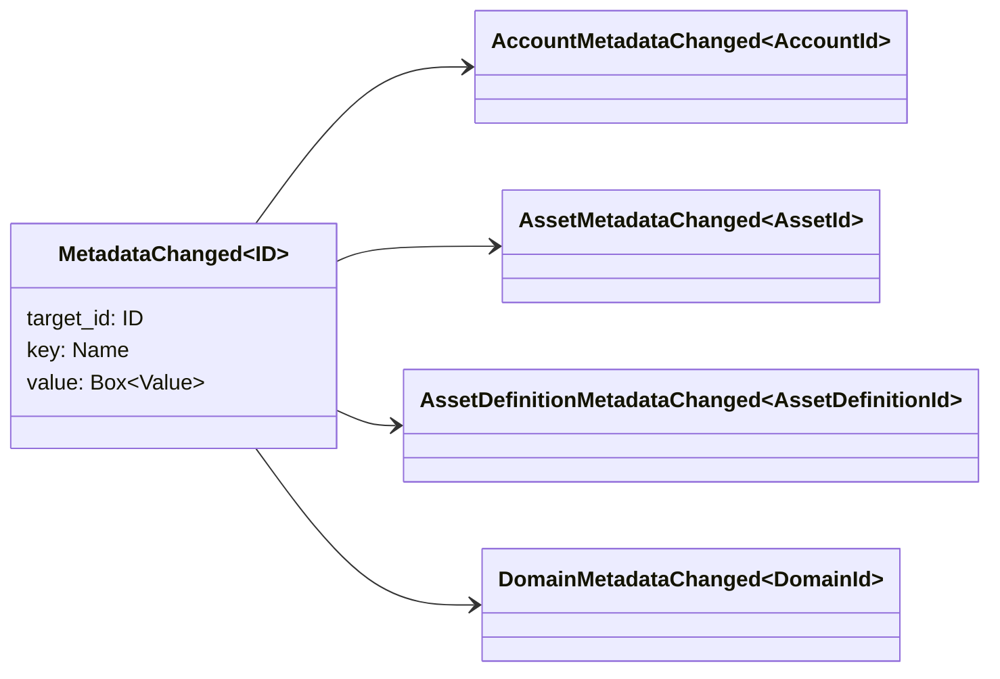

# Metadata

Metadata are key-value pairs that are attached to objects in the
blockchain. The following can contain metadata:

- domains
- accounts
- assets
- asset definitions
- triggers
- transactions

The metadata can be of very different types, such as:

- structures with named or unnamed fields
- enums
- integers
- numbers with fixed decimal precision
- strings
- Boolean values
- arrays
- associative arrays
- vectors
- request results

The object's metadata can be transferred one by one, or in bulk via a
[WASM](/blockchain/wasm.md) transaction. The `Store` asset type is
used for working with metadata. Let's take a closer look at this asset
type.

## `MetadataChanged`

`MetadataInserted` or `MetadataRemoved` events are emitted when metadata is
inserted or removed from accounts, domains, assets, or asset definitions.
The emitted event also contains the data that was inserted or removed from
the object. This data is stored in `MetadataChanged` in the form of a
`(key, value)` pair.



Check [data filters](./filters.md#data-filters) for details.

## `Store` Asset

In Iroha 2 there is an asset called `Store` that was designed to be a
package of data. You can use `Store` when you require a storage of
key-value pairs. The `SetKeyValue` and `RemoveKeyValue` instructions are
used with the `Store` asset type. Here is an example of `SetKeyValue`
instruction:

```rust
// Mouse's account
let mouse_id: AccountId = "mouse@wonderland".parse();

// Registering `Store` asset definition
let hat_definition_id: AssetDefinitionId =
    "hat#wonderland".parse();
let new_hat_definition = AssetDefinition::store(hat_definition_id);
let register_hat = RegisterBox::new(new_hat_definition);

let mouse_hat_id = AssetId::new(hat_definition_id, mouse_id);

// New Iroha Special Instruction for setting key-value pairs for Mouse's hats:
let set_hat_color = SetKeyValueBox::new(
    mouse_hat_id,
    Name::from_str("color"),
    "yellow".to_owned(),
);
```

## Working with metadata

The following example showcases how to register and grant a
[role](/blockchain/permissions.md#permission-groups-roles) to access
another account's metadata.

::: details Example

```rust
#[test]
fn register_and_grant_role_for_metadata_access() -> Result<()> {
    let (_rt, _peer, test_client) = <PeerBuilder>::new().start_with_runtime();
    wait_for_genesis_committed(&vec![test_client.clone()], 0);

    let alice_id = AccountId::from_str("alice@wonderland")?;
    let mouse_id = AccountId::from_str("mouse@wonderland")?;

    // Registering Mouse
    let mouse_key_pair = KeyPair::generate()?;
    let register_mouse = RegisterBox::new(Account::new(
        mouse_id.clone(),
        [mouse_key_pair.public_key().clone()],
    ));
    test_client.submit_blocking(register_mouse)?;

    // Registering role
    let role_id = <Role as Identifiable>::Id::from_str("ACCESS_TO_MOUSE_METADATA")?;
    let role = iroha_data_model::role::Role::new(role_id.clone())
        .add_permission(CanSetKeyValueInUserMetadata::new(mouse_id.clone()))
        .add_permission(CanRemoveKeyValueInUserMetadata::new(mouse_id.clone()));
    let register_role = RegisterBox::new(role);
    test_client.submit_blocking(register_role)?;

    // Mouse grants role to Alice
    let grant_role = GrantBox::new(role_id.clone(), alice_id.clone());
    let grant_role_tx = Transaction::new(mouse_id.clone(), vec![grant_role.into()].into(), 100_000)
        .sign(mouse_key_pair)?;
    test_client.submit_transaction_blocking(grant_role_tx)?;

    // Alice modifies Mouse's metadata
    let set_key_value = SetKeyValueBox::new(
        mouse_id,
        Name::from_str("key").expect("Valid"),
        Value::String("value".to_owned()),
    );
    test_client.submit_blocking(set_key_value)?;

    // Making request to find Alice's roles
    let found_role_ids = test_client.request(client::role::by_account_id(alice_id))?;
    assert!(found_role_ids.contains(&role_id));

    Ok(())
}
```

:::

## Queries

You can get the key value of an object metadata using
[queries](/blockchain/queries.md):

- [`FindAccountKeyValueByIdAndKey`](/reference/queries.md#findaccountkeyvaluebyidandkey)
- [`FindAssetKeyValueByIdAndKey`](/reference/queries.md#findassetkeyvaluebyidandkey)
- [`FindAssetDefinitionKeyValueByIdAndKey`](/reference/queries.md#findassetdefinitionkeyvaluebyidandkey)
- [`FindDomainKeyValueByIdAndKey`](/reference/queries.md#finddomainkeyvaluebyidandkey)
- [`FindTriggerKeyValueByIdAndKey`](/reference/queries.md#findtriggerkeyvaluebyidandkey)

## Permissions

Pre-configured tokens in Iroha 2 that allow to set or remove
key-values in accounts, assets, asset definitions, and so on are described in [`Permissions`](/reference/permissions.md).
