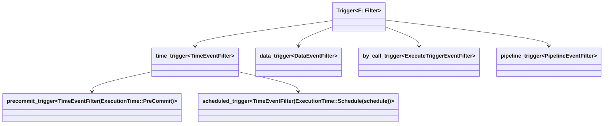

# Triggers

Certain things, such as changing the state of an entity, committing a block
or [executing an Iroha Special Instruction (ISI)](#supported-isi), can emit
[events](./events.md), and you can attach _triggers_ to these events.

A _trigger_ is a fairly basic entity that can be registered. Just like with
Accounts, to register a trigger, you submit a `RegisterBox::Trigger`, which
contains the necessary information:

- an account ID, which should ideally be a brand new account that you
  register in the same transaction
- an executable, which itself is either a `Vec<Instruction>` or a WASM blob
- an `EventFilter`[^1], which is something that combs through all[^2]
  events and returns `true` when it finds the matching event to start the
  execution

[^1]:
    The documentation on the `EventFilter` types is under construction, as
    we are likely to make major changes to that particular architecture.
    For now, suffice it to say that you can look at the
    [source code](https://github.com/hyperledger/iroha/blob/main/data_model/src/events/data/filters.rs)
    in `iroha_data_model` and see a few particularly interesting
    applications.

[^2]: This behaviour is likely to change in future releases.

    <!-- Check: a reference about future releases or work in progress -->

Let's take a closer look at how triggers work.

<!-- We should probably have a Queen of Hearts here, as we have a lot of `execute`, `trigger` and `block` -->

## The Anatomy of a Trigger

A trigger has roughly the following form:

```rust
struct Trigger {
  id: TriggerId,
  action: Action,
}
```

### `Trigger.id`

The `TriggerId` is a simple wrapper around a single `Name`, a string with
no whitespaces and no reserved characters (`@`, `#`, `$`).

A typical [domain-scoped trigger](#domain-scoped-triggers) looks like
`trigger_id$domain_name`, while a bare trigger looks like `@@trigger_id`,
which makes these names easy to parse.

### `Trigger.action`

An `Action` is the heart of the trigger. It is defined like this:

```rust
struct Action {
  executable: Executable,
  repeats: Repeats,
  technical_account: AccountId,
  filter: EventFilter,
  metadata: Metadata,
}
```

#### `Action.executable`

The executable linked to this action, either a `Vec<Instruction>` or a WASM
binary.

#### `Action.repeats`

The `Repeats` is a universal enumeration of all possible repetition
schemes.

```rust
enum Repeats {
  Indefinitely,
  Exactly(u32),
}
```

#### `Action.technical_account`

A technical account is the account that would (in theory) be responsible
for the execution environment and be the authority for `Instruction`
execution.

For now, you can leave this as the account that registered the trigger. If
you have been following the tutorial, this is `alice@wonderland`. However,
later on we will show you why you'd want to create a brand new account for
those purposes.

::: info

Note that you can only use the account that already exists in order to be
able to register a new trigger.

:::

#### `Action.filter`

A filter is what determines what _kind_ of trigger you're dealing with. All
triggers respond to events, but the precise type of event that activates a
trigger depends on which `EventFilter` was used.

The reason why we chose this architecture is simple; front end code has an
abundance of event filters, and so, your knowledge of filters is
transferable to writing smart contracts.

#### `Action.metadata`

This `Metadata` is the same kind of `Metadata` that can be attached to
accounts, domains, assets, or transactions. This is the storage for trigger
data.

You can learn more about metadata in a
[dedicated section](/blockchain/metadata.md).

## How Triggers Work

As we already said, the `filter` that is used to register a trigger
determines what kind of trigger this is. It is, of course, also determines
how the trigger works, e.g. when it is executed. We will go into more
details about the types of triggers in just a moment.

First, we shall point out that there two other characteristics of a trigger
that determine how this trigger works: its scope and repetition schema.

### Scope

Triggers can be scoped and un-scoped. Iroha supports both un-scoped
system-wide triggers as well as
[domain-scoped triggers](#domain-scoped-triggers). Since system-wide
triggers scan all events, and domain-scoped triggers only scan events
emitted in a certain domain, it is highly recommended to use domain-scoped
triggers where possible.

::: info

Be mindful of the limitations. Currently triggers don't check for
permissions <!-- Q: still true? -->, so they can do things your account
wouldn't be allowed to. Un-scoped triggers process _every_ event, and the
amount of work grows quadratically.

<!-- Check: a reference about future releases or work in progress -->

:::

#### Domain-scoped Triggers

While un-scoped triggers check all events of a specified type,
domain-scoped triggers only look for events in a given domain. These
triggers are more optimised compared to un-scoped triggers.

You can use [`FindTriggersByDomainId`](/reference/queries.md#findtriggersbydomainid)
query to find triggers for the given domain.

When you register a domain-scoped trigger, you need to add the domain id to
the trigger id using `$` symbol: `my_trigger$my_domain`.

### Repetition Schema

Each such trigger can be set to repeat either `Indefinitely` or
`Exactly(n)` times, where `n` is a 32-bit integer. Once the number of
repetitions reaches zero, the trigger is gone. That means that if your
trigger got repeated exactly `n` times, you can't `Mint` new repetitions,
you have to `Register` it again, with the same name.

After a trigger is repeated for the last time, i.e. the execution count
reaches `0`, the trigger should be un-registered.

<!-- TODO: test if reaches zero needs to re-register. -->

## Types of Triggers

We shall cover the following basic types of triggers and provide you with
the detailed information on how to use each of them:

- [Data triggers](#data-triggers)
- [Time triggers](#time-triggers)
  - [Scheduled triggers](#scheduled-triggers)
  - [Pre-commit triggers](#pre-commit-triggers)
- [By-call triggers](#by-call-triggers)

All triggers are essentially **event triggers**. The type of a trigger is
determined by the type of an event that trigger is associated with. This,
in turn, is determined by the `filter` used to register a trigger.



### Data Triggers

This category includes the largest variety of triggers. The events that are
associated with this trigger type account for the vast majority of events
in Ethereum. These are [data-related events](./events.md#data-events), such
as: an account got registered, an asset got transferred, the Queen of
Hearts decided to burn all of her assets.

### Time Triggers

Time triggers behave slightly differently compared to data triggers. There
are two sub-types of this type: [scheduled triggers](#scheduled-triggers)
and [pre-commit triggers](#pre-commit-triggers).

Instead of processing all the events generated by normal transactions, all
time triggers process one event: the **block formation event**.

The filters of scheduled triggers are only interested in the timestamp
provided in that event, but not the block height, and not the current time.
They are executed according to a certain schedule. Pre-commit triggers, on
the other hand, are executed right before a block is committed.

#### Scheduled Triggers

When going through consensus, all peers must agree on which triggers got
executed. Scheduled triggers can't use real time, because then you can
easily create a situation when they would never agree: e.g. by giving the
`Repeats::Indefinitely` trigger a period that is smaller than the time it
takes to pass consensus. It's really that simple.

So instead of using the actual current time at each peer, we use the time
when the block got started plus a small offset. All triggers before that
point in time get executed. All triggers that would be executed after that
time wait for the next block.

::: details Why we use the offset

The reason why we add this offset has to do with Iroha being _best effort_.

Imagine if we didn't have the offset... Normally, triggers would be set to
nice round numbers; e.g. `12:00`, `12:05`, `11:55`, etc. (as opposed to
e.g. `11:59`). However, the consensus can start at any point in time and
could last a while.

Suppose that the block started to form at `11:56` and consensus finished at
`12:03` (which is optimistically quick). Let's consider different
scenarios:

- If your trigger was supposed to run at `11:55`, you'd be happy, since
  your trigger got executed just 1 minute late.
- If your trigger was supposed to run at `12:05`, it will run in the next
  block, not the one that was formed at `11:56`. If you're the author and
  you're looking at the time stamp of `12:03`, it makes sense, your trigger
  wasn't supposed to run yet.
- For the trigger scheduled for `12:00`, the situation is different. You
  look at the clock, you see `12:03`, which is when the blockchain explorer
  shows you the block data was committed, but you don't see your trigger.
  It was supposed to run, but didn't.

So, the offset is meant to anticipate when the block would get added to the
chain, so that people who were just 4 minutes early don't have to be
potentially several hours late.

Because more triggers get executed sooner, your throughput is also
infinitesimally smaller.

We could also say "you should aim to execute your trigger slightly earlier
than consensus starts", but people writing smart contracts already have too
much to worry about.

:::

#### Pre-commit Triggers

This is a variant of timed triggers that gets run before blocks with
transactions get committed. It leaves a special event to be triggered in
the next block. Effectively, it's a delayed pre-commit that can track the
behaviour of transactions in the pipeline.

::: info

These triggers are not meant for restricting the execution of transactions.

If you want to stop your users from transferring more than X amount of Y to
user Z, you really want a _permission_. While you could hack the pre-commit
triggers to emulate the desired behaviour, this is not economical neither
in terms of gas fees nor computation.

<!-- Check: a reference about future releases or work in progress -->

Until Iroha 2 supports WASM-based _permissions validators_, however, your
only choice is pre-commit triggers.

:::

### By-call Triggers

These triggers only get executed once the `CallTrigger(trigger_name)`
instruction is executed. They can be useful if you want to achieve dynamic
linkage between different smart contract modules.

Space is precious, so you want to use as little of it as you can. Thus, you
follow the UNIX design philosophy, and instead of creating one large smart
contract, you create many smaller ones, and re-use as much logic as you
can.

::: info

Of course, this is a rather exotic use case, so it shall be implemented
last.

:::

## Supported ISI

All Iroha Special Instructions work with triggers, specifically:

- `Register<Trigger>`: Create a trigger object and subscribe it to global
  events.

- `Unregister<Trigger>`: Remove a trigger from the World State View and
  stop passing events through it.

- `Mint<Trigger, u32>`: For triggers that repeat a certain number of times,
  increase the number of times that the trigger gets executed. Can be done
  from inside the executable of the trigger.

- `Burn<Trigger, u32>`: For triggers that repeat a certain number of times,
  decrease the number of times that the trigger gets executed.

  ::: warning

  If the number provided is greater than the remaining number of repetitions,
  the instruction will fail to execute, and the transaction that it is part of will be
  rejected.

  :::

You can learn more about Iroha Special Instructions in the
[dedicated section](instructions.md).

## Supported Queries

We [list supported queries](/reference/queries.md#trigger) for triggers when we talk
in more detail about queries in the next chapter.
