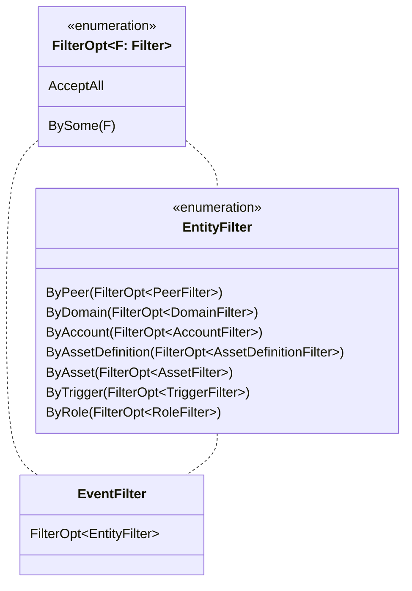

# Filters

Iroha uses _filter-map paradigm_ to monitor [events](./events.md). Let's
look at different types of filters that can be used in Iroha.

## Data Filters

A data filter is a tuple with a single variant, which is a `FilterOpt` of
an `EntityFilter`:

`FilterOpt` stands for Optional Filter. It can either `AcceptAll` or accept
`BySome` of another `Filter`. An `EntityFilter` is a filter that matches
events produced by a certain type entity, e.g. by account or domain.

Here is the list of `EntityFilter`s in Iroha:

```mermaid
classDiagram

direction LR

class TriggerFilter {
    type EventType = TriggerEvent
    type EventFilter = TriggerEventFilter
}

class TriggerEventFilter {
    <<enumeration>>
    ByCreated
    ByDeleted
    ByExtended
    ByShortened
}

class TriggerEvent {
    <<enumeration>>
    Created(TriggerId)
    Deleted(TriggerId)
    Extended(TriggerNumberOfExecutionsChanged)
    Shortened(TriggerNumberOfExecutionsChanged)
}

class TriggerNumberOfExecutionsChanged {
    trigger_id: TriggerId
    by: u32
}

TriggerFilter .. TriggerEvent
TriggerEvent .. TriggerNumberOfExecutionsChanged
TriggerFilter .. TriggerEventFilter


class RoleFilter {
    type EventType = RoleEvent
    type EventFilter = RoleEventFilter
}

class RoleEventFilter {
    <<enumeration>>
    ByCreated
    ByDeleted
}

class RoleEvent {
    <<enumeration>>
    Created(RoleId)
    Deleted(RoleId)
    PermissionRemoved(PermissionRemoved)
}

class PermissionRemoved {
    role_id: RoleId
    permission_definition_id: PermissionTokenDefinitionId
}

RoleFilter .. RoleEvent
RoleEvent .. PermissionRemoved
RoleFilter .. RoleEventFilter


class PeerFilter {
    type EventType = PeerEvent
    type EventFilter = PeerEventFilter
}

class PeerEventFilter {
    <<enumeration>>
    ByAdded
    ByRemoved
}

class PeerEvent {
    <<enumeration>>
    Added(PeerId)
    Removed(PeerId)
}

PeerFilter .. PeerEvent
PeerFilter .. PeerEventFilter




class AssetDefinitionFilter {
    type EventType = AssetDefinitionEvent
    type EventFilter = AssetDefinitionEventFilter
}

class AssetDefinitionEventFilter {
    <<enumeration>>
    ByCreated
    ByDeleted
    ByMintabilityChanged
    ByMetadataInserted
    ByMetadataRemoved
}

class AssetDefinitionEvent {
    <<enumeration>>
    Created(AssetDefinitionId)
    MintabilityChanged(AssetDefinitionId)
    Deleted(AssetDefinitionId)
    MetadataInserted(AssetDefinitionMetadataChanged)
    MetadataRemoved(AssetDefinitionMetadataChanged)
}

class AssetDefinitionMetadataChanged {
    target_id: AssetDefinitionId
    key: Name
    value: Box~Value~
}

AssetDefinitionFilter .. AssetDefinitionEvent
AssetDefinitionEvent .. AssetDefinitionMetadataChanged
AssetDefinitionFilter .. AssetDefinitionEventFilter



class AssetFilter {
    type EventType = AssetEvent
    type EventFilter = AssetEventFilter
}

class AssetEventFilter {
    <<enumeration>>
    ByCreated
    ByDeleted
    ByAdded
    ByRemoved
    ByMetadataInserted
    ByMetadataRemoved
}

class AssetEvent {
    <<enumeration>>
    Created(AssetId)
    Deleted(AssetId)
    Added(AssetChanged)
    Removed(AssetChanged)
    MetadataInserted(AssetMetadataChanged)
    MetadataRemoved(AssetMetadataChanged)
}

class AssetChanged {
    asset_id: AssetId
    amount: AssetValue
}

class AssetMetadataChanged {
    target_id: AssetId
    key: Name
    value: Box~Value~
}

AssetFilter .. AssetEvent
AssetEvent .. AssetChanged
AssetEvent .. AssetMetadataChanged
AssetFilter .. AssetEventFilter



class DomainFilter {
    type EventType = DomainEvent
    type EventFilter = DomainEventFilter
}

class DomainEventFilter {
    <<enumeration>>
    ByAccount(FilterOpt~AccountFilter~)
    ByAssetDefinition(FilterOpt~AssetDefinitionFilter~)
    ByCreated
    ByDeleted
    ByMetadataInserted
    ByMetadataRemoved
}

class DomainEvent {
    <<enumeration>>
    Account(AccountEvent)
    AssetDefinition(AssetDefinitionEvent)
    Created(DomainId)
    Deleted(DomainId)
    MetadataInserted(DomainMetadataChanged)
    MetadataRemoved(DomainMetadataChanged)
}

class DomainMetadataChanged {
    target_id: DomainId
    key: Name
    value: Box~Value~
}

DomainFilter .. DomainEvent
DomainEvent .. DomainMetadataChanged
DomainFilter .. DomainEventFilter


class AccountFilter {
    type EventType = AccountEvent
    type EventFilter = AccountEventFilter
}

class AccountEventFilter {
    <<enumeration>>
    ByAsset(FilterOpt~AssetFilter~)
    ByCreated
    ByDeleted
    ByAuthenticationAdded
    ByAuthenticationRemoved
    ByPermissionAdded
    ByPermissionRemoved
    ByRoleRevoked
    ByRoleGranted
    ByMetadataInserted
    ByMetadataRemoved
}

class AccountEvent {
    <<enumeration>>
    Asset(AssetEvent)
    Created(AccountId)
    Deleted(AccountId)
    AuthenticationAdded(AccountId)
    AuthenticationRemoved(AccountId)
    PermissionAdded(AccountPermissionChanged)
    PermissionRemoved(AccountPermissionChanged)
    RoleRevoked(AccountRoleChanged)
    RoleGranted(AccountRoleChanged)
    MetadataInserted(AccountMetadataChanged)
    MetadataRemoved(AccountMetadataChanged)
}

class AccountPermissionChanged {
    account_id: AccountId
    permission_id: PermissionTokenId
}

class AccountRoleChanged {
    account_id: AccountId
    role_id: RoleId
}

class AccountMetadataChanged {
    target_id: AccountId
    key: Name
    value: Box~Value~
}

AccountFilter .. AccountEvent
AccountEvent .. AccountPermissionChanged
AccountEvent .. AccountRoleChanged
AccountEvent .. AccountMetadataChanged
AccountFilter .. AccountEventFilter
```

