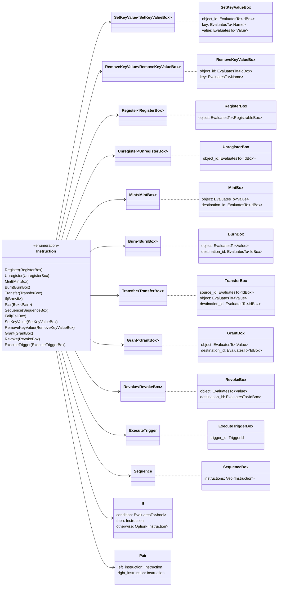

# Iroha Special Instructions

When we spoke about [how Iroha operates](/index.md#how-iroha-works), we
said that Iroha Special Instructions are the only way to modify the world
state. So, what kind of special instructions do we have? If you've read the
language-specific guides in this tutorial, you've already seen a couple of
instructions: `Register<Account>` and `Mint<Quantity>`.

Here is the full list of Iroha Special Instructions:

| Instruction                                               | Descriptions                                      |
| --------------------------------------------------------- | ------------------------------------------------- |
| [Register/Unregister](#un-register)                       | Give an ID to a new entity on the blockchain.     |
| [Mint/Burn](#mint-burn)                                   | Mint/burn assets, triggers, or permission tokens. |
| [SetKeyValue/RemoveKeyValue](#setkeyvalue-removekeyvalue) | Update blockchain object metadata.                |
| [NewParameter/SetParameter](#newparameter-setparameter)   | Create/set a chain-wide config parameter.         |
| [Grant/Revoke](#grant-revoke)                             | Give or remove certain permissions from accounts. |
| [Transfer](#transfer)                                     | Transfer assets between accounts.                 |
| [ExecuteTrigger](#executetrigger)                         | Execute triggers.                                 |
| [If, Pair, Sequence](#composite-instructions)             | Use to create composite instructions.             |

Let's start with a summary of Iroha Special Instructions; what objects each
instruction can be called for and what instructions are available for each
object.

## Summary

::: details Diagram: Iroha Special Instructions

:::

For each instruction, there is a list of objects on which this instruction
can be run on. For example, only assets can be transferred, while minting
can refer to assets, triggers, and permission tokens.

Some instructions require a destination to be specified. For example, if
you transfer assets, you always need to specify to which account you are
transferring them. On the other hand, when you are registering something,
all you need is the object that you want to register.

| Instruction                                               | Objects                                                                                                               | Destination |
| --------------------------------------------------------- | --------------------------------------------------------------------------------------------------------------------- | ----------- |
| [Register/Unregister](#un-register)                       | accounts, domains, asset definitions, triggers, roles, peers                                                          |             |
| [Mint/Burn](#mint-burn)                                   | assets, triggers (trigger repetitions), permission tokens                                                             | accounts    |
| [SetKeyValue/RemoveKeyValue](#setkeyvalue-removekeyvalue) | any objects that have [metadata](./metadata.md): accounts, domains, assets, asset definitions, triggers, transactions |             |
| [NewParameter/SetParameter](#newparameter-setparameter)   | Iroha configuration parameters                                                                                        |             |
| [Grant/Revoke](#grant-revoke)                             | [roles, permission tokens](/guide/blockchain/permissions.md)                                                          | accounts    |
| [Transfer](#transfer)                                     | assets                                                                                                                | accounts    |
| [ExecuteTrigger](#executetrigger)                         | triggers                                                                                                              |             |
| [If, Pair, Sequence](#composite-instructions)             | any instructions                                                                                                      |             |

There is also another way of looking at ISI, i.e. in terms of the target of
each instruction. For example, when you register an account, you do so
within a certain domain. This means that the _target_ of the
`Register<Account>` instruction would be the domain within which it is
being registered.

| Target  | Instructions                                                                                                                                                                |
| ------- | --------------------------------------------------------------------------------------------------------------------------------------------------------------------------- |
| Account | (un)register assets, mint/burn account public key, mint/burn account signature condition check, update account metadata, grant/revoke a permission token, grant/revoke role |
| Domain  | (un)register accounts, (un)register asset definitions, update asset metadata, update domain metadata                                                                        |
| Asset   | update metadata, mint/burn, transfer                                                                                                                                        |
| Trigger | (un)register, mint/burn trigger repetitions, execute trigger                                                                                                                |
| World   | (un)register domains, peers, roles                                                                                                                                          |

## (Un)Register

Registering and unregistering are the instructions used to give an ID to a
new entity on the blockchain.

Everything that can be registered is both `Registrable` and `Identifiable`,
but not everything that's `Identifiable` is `Registrable`. Most things are
registered directly, like `Peer`s, but in some cases the representation in
the blockchain has considerably more data. For security and performance
reasons, we use builders for such data structures (e.g. `NewAccount`). As a
rule, everything that can be registered, can also be un-registered, but
that is not a hard and fast rule.

You can register domains, accounts, asset definitions, peers, roles, and
triggers. Check our [naming conventions](./naming.md) to learn about the
restrictions put on entity names.

::: info

Note that depending on how you decide to set up your
[genesis block](/guide/configure/genesis.md) in `genesis.json`
(specifically, whether or not you include registration of permission
tokens), the process for registering an account can be very different. In
general, we can summarise it like this:

- In a _public_ blockchain, anyone should be able to register an account.
- In a _private_ blockchain, there can be a unique process for registering
  accounts. In a _typical_ private blockchain, i.e. a blockchain without
  any unique processes for registering accounts, you need an account to
  register another account.

We discuss these differences in great detail when we
[compare private and public blockchains](/guide/configure/modes.md).

:::

::: info

Registering a peer is currently the only way of adding peers that were not
part of the original `TRUSTED_PEERS` array to the network.

<!-- Check: a reference about future releases or work in progress -->

:::

Refer to one of the language-specific guides to walk you through the
process of registering objects in a blockchain:

| Language              | Guide                                                                                                                                                                                                  |
| --------------------- | ------------------------------------------------------------------------------------------------------------------------------------------------------------------------------------------------------ |
| Bash                  | Register a [domain](/guide/bash.md#_3-registering-a-domain), an [account](/guide/bash.md#_4-registering-an-account), an [asset](/guide/bash.md#_5-registering-and-minting-assets)                      |
| Rust                  | Register a [domain](/guide/rust.md#_3-registering-a-domain), an [account](/guide/rust.md#_4-registering-an-account), an [asset](/guide/rust.md#_5-registering-and-minting-assets)                      |
| Kotlin/Java           | Register a [domain](/guide/kotlin-java.md#_3-registering-a-domain), an [account](/guide/kotlin-java.md#_4-registering-an-account), an [asset](/guide/kotlin-java.md#_5-registering-and-minting-assets) |
| Python                | Register a [domain](/guide/python.md#_3-registering-a-domain), an [account](/guide/python.md#_4-registering-an-account), an [asset](/guide/python.md#_5-registering-and-minting-assets)                |
| JavaScript/TypeScript | Register a [domain](/guide/javascript.md#_3-registering-a-domain), an [account](/guide/javascript.md#_4-registering-an-account), an [asset](/guide/javascript.md#_5-registering-and-minting-assets)    |

## Mint/Burn

Minting and burning can refer to assets, triggers (if the trigger has a
limited number of repetitions), and temporary permission tokens. Some
assets can be declared as non-mintable, meaning that they can be minted
only once after registration.

Assets and permission tokens need to be minted to a specific account,
usually the one that registered the asset in the first place. All assets
are assumed to be non-negative as well, so you can never have $-1.0$ of
`time` or `Burn` a negative amount and get a `Mint`.

Refer to one of the language-specific guides to walk you through the
process of minting assets in a blockchain:

- [Bash](/guide/bash.md#_5-registering-and-minting-assets)
- [Rust](/guide/rust.md#_5-registering-and-minting-assets)
- [Kotlin/Java](/guide/kotlin-java.md#_5-registering-and-minting-assets)
- [Python](/guide/python.md#_5-registering-and-minting-assets)
- [JavaScript/TypeScript ](/guide/javascript.md#_5-registering-and-minting-assets)

Here are examples of burning assets:

- [Bash](/guide/bash.md#_7-burning-assets)
- [Rust](/guide/rust.md#_6-burning-assets)

## Transfer

Similar to mint and burn instructions, transferring refers to assets. You
can transfer assets between different accounts.

To do this, an account have to be granted the
[permission to transfer assets](./permissions.md#cantransferuserassets).
Refer to an example on how to
[transfer assets in Bash](/guide/bash.md#_6-transferring-assets).

<!--TODO: add links to transferring assets example in which guide after https://github.com/hyperledger/iroha-2-docs/issues/81 is addressed -->

## Grant/Revoke

Grant and revoke instructions are used for account
[permissions and roles](permissions.md).

`Grant` is used to permanently grant a user either a single permission, or
a group of permissions (a "role"). Granted roles and permissions can only
be removed via the `Revoke` instruction. As such, these instructions should
be used carefully.

## `SetKeyValue`/`RemoveKeyValue`

These instructions are used with the key/value
[`Store` asset type](/guide/blockchain/metadata.md#store-asset). This use
case has not received much attention so far, because storing data in the
blockchain is a rather advanced topic that we shall cover separately.

## `NewParameter`/`SetParameter`

With these instructions, you can create (`NewParameter`) and change
(`SetParameter`) chain-wide
[configuration parameters](./../configure/client-configuration.md) for
Iroha.

## `ExecuteTrigger`

This instruction is used to execute [triggers](./triggers.md).

## Composite instructions

Iroha also offers composite instructions (`If`, `Pair`, `Sequence`) to
execute instructions in a certain way:

- `If`: execute one of the two given instructions based on a given
  condition
- `Sequence`: execute a provided vector of instructions in a given order
- `Pair`: execute both provided instructions in a specified order
