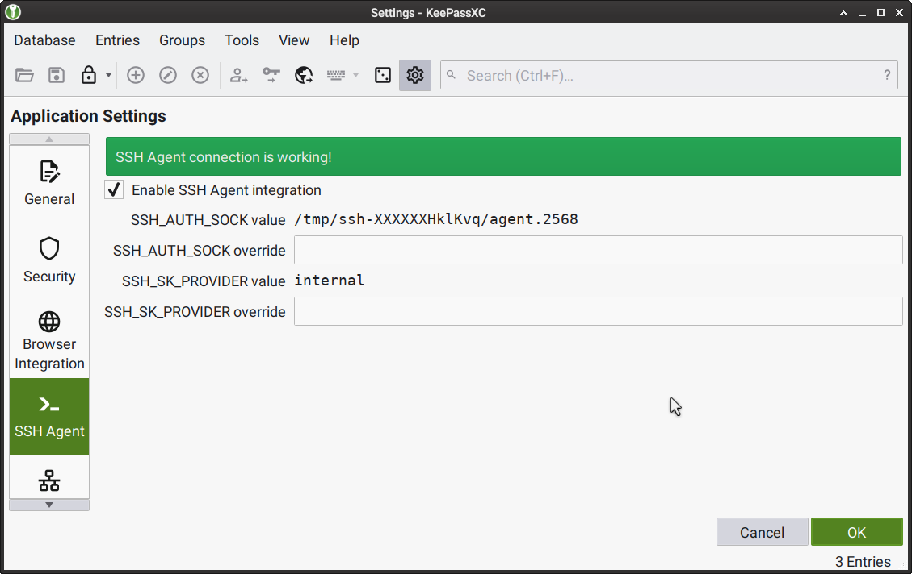
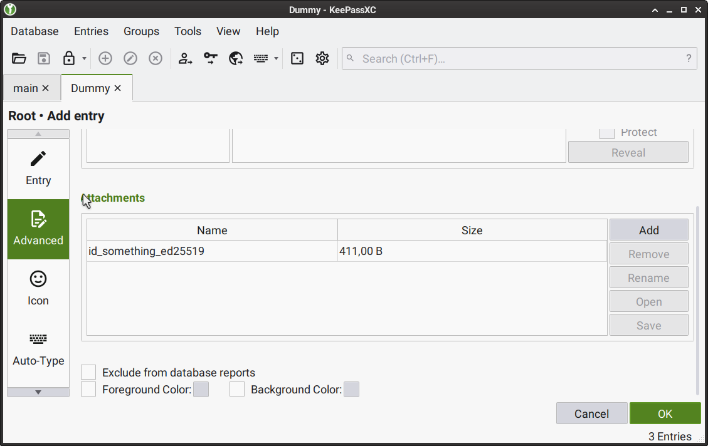

# Working with the cryptographic keys

## Creating and using the keys

::: warning
We have created several code tutorials and an article about [public-key cryptography](./keys.html). Despite us using `JSON` in tutorial examples to store the keys plainly, this approach is only used for demonstration purposes because you need a more secure one for production use. Iroha 2 will directly support better practices with time.

Your case may not require us to roll out the new features since you’ll probably use it as a framework in your blockchain setup and can partially implement your solution.
:::

::: info
This article will cover key creation at a later date with some changes in the Kagami tool.
:::

There are several approaches you can rely on while storing the keys.

We will start with the `ssh` and `ssh-agent`[^1] approaches because [`ssh`](https://www.openssh.com/) partially inspired some parts of Iroha 2.
If you don’t know what `ssh` does, it is a shell allowing the user to log in to other machines. It supports using a password and a more secure approach with public and private keys for login. In that case, the public key is added to a server so it can trust your user.
When you create a private key for ssh to use, consider adding a password for safety.
To avoid writing it each time you log in, you may add the resulting keys to the keychain so ssh can access it while connecting to other machines.
Only specific programs have access to the `ssh-agent` socket file. Therefore, its security depends on the security of your operating system, and you have to be extra careful about the possibility of malware.

You may already use [KeePass](https://keepass.info/) password manager or one of its forks[^2].

The advantage of the KeePass approach is an extra layer of security and more control and flexibility.
Besides the passwords, it can also store `ssh` keys.
When your database is open, the `ssh-agent` gains access to the keys. When you close the password manager's window, the `ssh-agent` immediately removes the keys.

To configure KeePassXC, open the settings panel and make sure that `ssh-agent` integration is enabled.

Add each key you use as a separate record, attaching your key files in the `Advanced` category.

Make sure to use the maximum security options:

::: info
When the key access is a part of critical infrastructure, for example, production use of Iroha 2, you should be careful with the configuration of the password manager because "Remove keys from the agent when the database is closed/locked" is an option. You should enable it.
:::

::: info
The `ssh-agent` may not monitor the process that provided it with a key without the "Require user confirmation when this key is used" option. Suppose such a process receives a `SIGKILL` signal from malware or a system service, terminating the password manager process. Unix systems programs cannot intercept `SIGKILL`, so this action most likely leaves the key in the ssh-agent.
:::

Our team considers the hardware keys as the best safety measures. There are good reasons for it: many security-related processes happen on a separate device connected by the `USB` port, which has a size of a typical flash drive. You can easily disconnect or reuse such a device on another machine. The disadvantage is that there are many brands, each with its API. So far, our team has tested [YubiKey 5C](https://www.yubico.com/il/product/yubikey-5c/) keys internally. These have many positive features.

However, there’s a pitfall: using the [HMAC challenge-response authentication](https://en.wikipedia.org/wiki/Challenge%E2%80%93response_authentication) and storing a key for such a response would allow guessing what is stored in YubiKey’s memory, limiting the overall security.

You can open a KeePass database with YubiKeys, [gaining some advantages](https://security.stackexchange.com/a/258414/15190): it would be better than most passwords, and if your database gets leaked, one would still need the hardware key to access it. Moreover, if some malware previously recorded the YubiKey responses, those would be useless.
Suppose you don’t want to use KeePass and its derivatives, enhanced by the hardware keys, to control the ssh-agent. In that case, we recommend waiting until we extend Iroha 2 with the hardware key support.

## Storing keys safely

While we discussed public-key cryptography in [another article](../configure/keys), the question of how the user should approach security remains.

Let's think about public-key cryptography in terms of having two keys, one for closing something and another for opening it. Our information is only private if we take care of <abbr title="operational security">OPSEC</abbr> by protecting our keys. You need to be prepared for social engineering. There are many situations when someone asks you for a key and pretends to be, for example, someone with authority. The goal here is to steal your information, but asymmetric cryptography is not a magic wand, and you **should refuse** requests to send your private key to anyone. We use cryptography to protect data and don't give keys to our apartments to random people. We should approach data the same way.

Luckily, there are more security measures we can take to guarantee others don't access such a key, so let's discuss the actions we can take against typical attack vectors.

Instead of just having a key, we can encrypt it with a password so that if the private key is stolen, it cannot be used by another person. The longer the password, the higher its entropy, and a key with an unpredictable password is harder to recover. Storing passwords in encrypted key storage software like KeePass eliminates the need to remember them. Please remember that encryption only slows down identity theft. Therefore, you should report lost keys to the Iroha administrator early and replace them if you suspect identity theft.

The analogy to apartment keys remains in other cases. A single key for each door is worse than a whole bunch of keys. For example, while GitHub uses [Ed2519](https://ed25519.cr.yp.to/) keys, it is better to have more than one such key so that an attacker has fewer opportunities to identify you.

In addition to this approach, you can also physically minimize the possibility of key theft. Store keys on a flash drive with encrypted key storage such as KeePass, keep the backup copy in a trusted location, periodically ensure that the computer you are using does not back up your key database (i.e., is trusted) by verifying file access logs or asking the administrator to do so, and use a hardware key such as YubiKey or NitroKey to open the key database. Even if someone only has access to your data, they will need your hardware keys to open it.

There is another way: you can memorise a private key as a series of words to recover it. This approach is called “mnemonic phrase” and is used in many wallets. The mnemonic phrase should preferably contain 25 words; you can select the words using the XKCD password generator [^3].

[^1]: You can read more about `ssh-agent` specifics [here](https://www.ssh.com/academy/ssh/agent).
[^2]: [KeePassX](https://www.keepassx.org/) or [KeePassXC](https://keepassxc.org/).
[^3]: https://xkpasswd.net/s/ and https://preshing.com/20110811/xkcd-password-generator/