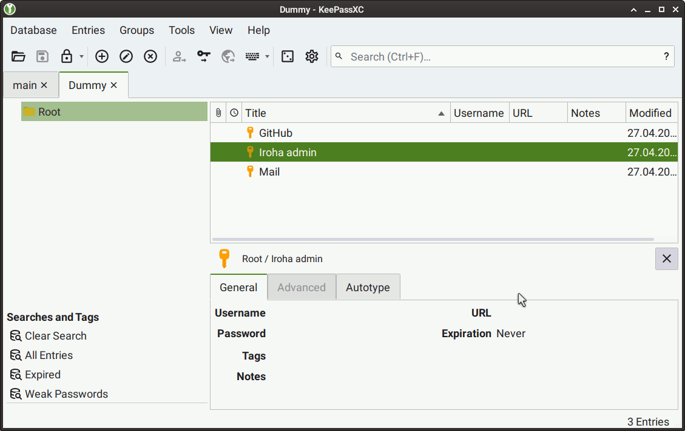

# Working with the cryptographic keys

## Creating and using the keys

::: warning
We have created several code tutorials and an article about [public-key cryptography](./keys.html). Despite us using `JSON` in tutorial examples to store the keys plainly, this approach is only used for demonstration purposes because you need a more secure one for production use. Iroha 2 will directly support better practices with time.

Your case may not require us to roll out the new features since you’ll probably use it as a framework in your blockchain setup and can partially implement your solution.
:::

::: info
This article will cover key creation at a later date with some changes in the Kagami tool.
:::

There are several approaches you can rely on while storing the keys.

We will start with the `ssh` and `ssh-agent`[^ssh-agent] approaches because [`ssh`](https://www.openssh.com/) partially inspired some parts of Iroha 2.
If you don’t know what `ssh` does, it is a shell allowing the user to log in to other machines. It supports using a password and a more secure approach with public and private keys for login. In that case, the public key is added to a server so it can trust your user.
When you create a private key for ssh to use, consider adding a password for safety.
To avoid writing it each time you log in, you may add the resulting keys to the keychain so ssh can access it while connecting to other machines.
Only specific programs have access to the `ssh-agent` socket file. Therefore, its security depends on the security of your operating system, and you have to be extra careful about the possibility of malware.

You may already use [KeePass](https://keepass.info/) password manager or one of its forks[^keepass].

The advantage of the KeePass approach is an extra layer of security and more control and flexibility.
Besides the passwords, it can also store `ssh` keys.
When your database is open, the `ssh-agent` gains access to the keys. When you close the password manager's window, the `ssh-agent` immediately removes the keys.

To configure KeePassXC, open the settings panel and make sure that `ssh-agent` integration is enabled.

Add each key you use as a separate record, attaching your key files in the `Advanced` category.

Make sure to use the maximum security options:

::: info
When the key access is a part of critical infrastructure, for example, production use of Iroha 2, you should be careful with the configuration of the password manager because "Remove keys from the agent when the database is closed/locked" is an option. You should enable it.
:::

::: info
The `ssh-agent` may not monitor the process that provided it with a key without the "Require user confirmation when this key is used" option. Suppose such a process receives a `SIGKILL` signal from malware or a system service, terminating the password manager process. Unix systems programs cannot intercept `SIGKILL`, so this action most likely leaves the key in the ssh-agent.
:::

Our team considers the hardware keys as the best safety measures. There are good reasons for it: many security-related processes happen on a separate device connected by the `USB` port, which has a size of a typical flash drive. You can easily disconnect or reuse such a device on another machine. The disadvantage is that there are many brands, each with its API. So far, our team has tested [YubiKey 5C](https://www.yubico.com/il/product/yubikey-5c/) keys internally. These have many positive features.

However, there’s a pitfall: using the [HMAC challenge-response authentication](https://en.wikipedia.org/wiki/Challenge%E2%80%93response_authentication) and storing a key for such a response would allow guessing what is stored in YubiKey’s memory, limiting the overall security.

You can open a KeePass database with YubiKeys, [gaining some advantages](https://security.stackexchange.com/a/258414/15190): it would be better than most passwords, and if your database gets leaked, one would still need the hardware key to access it. Moreover, if some malware previously recorded the YubiKey responses, those would be useless.
Suppose you don’t want to use KeePass and its derivatives, enhanced by the hardware keys, to control the ssh-agent. In that case, we recommend waiting until we extend Iroha 2 with the hardware key support.

## Storing keys safely

While we discussed public-key cryptography in [another article](../configure/keys), the question of how the user should approach security remains.

Let's think about public-key cryptography in terms of having two keys, one for closing something and another for opening it. Our information is only private if we take care of <abbr title="operational security">OPSEC</abbr> by protecting our keys. You need to be prepared for social engineering. There are many situations when someone asks you for a key and pretends to be, for example, someone with authority. The goal here is to steal your information, but asymmetric cryptography is not a magic wand, and you **should refuse** requests to send your private key to anyone. We use cryptography to protect data and don't give keys to our apartments to random people. We should approach data the same way.

Luckily, there are more security measures we can take to guarantee others don't access such a key, so let's discuss the actions we can take against typical attack vectors.

Instead of just having a key, we can encrypt it with a password so that if the private key is stolen, it cannot be used by another person. The longer the password, the higher its entropy, and a key with an unpredictable password is harder to recover. Storing passwords in encrypted key storage software like KeePass eliminates the need to remember them. Please remember that encryption only slows down identity theft. Therefore, you should report lost keys to the Iroha administrator early and replace them if you suspect identity theft.

The analogy to apartment keys remains in other cases. A single key for each door is worse than a whole bunch of keys. For example, while GitHub uses [Ed2519](https://ed25519.cr.yp.to/) keys, it is better to have more than one such key so that an attacker has fewer opportunities to identify you.

In addition to this approach, you can also physically minimize the possibility of key theft. Store keys on a flash drive with encrypted key storage such as KeePass, keep the backup copy in a trusted location, periodically ensure that the computer you are using does not back up your key database (i.e., is trusted) by verifying file access logs or asking the administrator to do so, and use a hardware key such as YubiKey or NitroKey to open the key database. Even if someone only has access to your data, they will need your hardware keys to open it.

There is another way: you can memorise a private key as a series of words to recover it. This approach is called “mnemonic phrase” and is used in many wallets. The mnemonic phrase should preferably contain 25 words; you can select the words using the XKCD password generator [^xkcd-password-generator].

# Password security

Often enough, you may see the recommendations about a “good password”. Those may entail a certain length, many types of characters, etc. The motivation is simple: entropy, or how random your password is. This randomness is necessary because people often attempt to find what your password is, given some circumstantial evidence. In addition, data leaks often allow to make the process of finding out a password easy and automated. For example,  some database contents or a password-protected key on a stolen USB flash drive would allow a specialist to derive a password by iterating through the options dictionary or combining all the possible characters.

You may wonder, what passwords are “good” and “bad”? Luckily, we have some real-world examples we could rely on. First of all, how do we define entropy? We have some parameters we can use, precisely, the length of our password and an alphabet. These parameters would let us find the amount of all possible password combinations. Assuming one uses only the $26$ lowercase alphabet letters, and the length of the password is $16$, we have the entropy of 43 sextillion possible symbol combinations. Using a modern Latin keyboard, we can easily have the alphabet with $96$ characters. $96^{16}$ is the entropy of $52$ nonillion, which is $1.1933×10^9$ times more. So, there is a grain of truth in the idea of a password consisting of “some uppercase and lowercase letters, numbers and at least two special characters”: it provides additional entropy.
But instead of going through all the hassle, let’s use password managers to generate and store passwords instead[^limited_entropy].

The passwords are cracked by using GPUs with a dictionary or by iterating through all possibilities. Create a unique password that is not related to your personal information, like birthday, address, phone or social security number: it makes cracking this password with a dictionary easier.

So, how hard it is to crack a modern password? Well, experts like [Kevin Mitnick](https://en.wikipedia.org/wiki/Kevin_Mitnick) have clusters with many GPUs, like [Kevin's cluster](https://twitter.com/kevinmitnick/status/1649421434899275778?s=20) with 24 Nvidia 4090's + Nvidia 6 2080's, all running [Hashtopolis](https://github.com/hashtopolis) software. This allows us to imagine how fast these things are: if a password takes a year to crack, the 4090s can crack it by half a month.

[This tweet](https://twitter.com/Chick3nman512/status/1580712040179826688) explains the speed of single RTX 4090: $300 GH / s$ NTLM and $200kh/s$ bcrypt.
Let’s assume the worst case scenario (for the user) with NTLM[^ntlm], $300 * 10^9$ hashes per second.

If our password consists only of the lowercase letters and has 16 symbols in it, it means bruteforcing goes through $26^{16}$ individual combinations for a single password in a leaked database. Let's do some back-of-the-envelope calculations to understand what that means in years of iterating through all possible combinations, i.e. "brute-forcing".

There are $3.154e+7$ or $31,540,000$ seconds in a year according to Google. Let's trust it to have the proper data for now. We'll assume the speed of a cracking on RTX 4090 we've discussed above as a reference: $300 * 10^9$ hashes per second. We'll start with a character set of 26 latin letters for simplicity.

$26^{16}$ / $300 * 10^9$ / $3.154e+7$ = $4,608.829$ years for a single [RTX 4090](https://www.nvidia.com/en-eu/geforce/graphics-cards/40-series/rtx-4090/).
$160$ generations of people may change in that time given the humanity's average quality of life. It looks reliable so far, but it can get better than that.

Let us switch to a [`bcrypt`](https://en.wikipedia.org/wiki/Bcrypt) hash function, lowering the iteration speed to $200 * 10^3$ hashes per second. We’ll use a 96-symbol character set that includes punctuation.

$96^{16}$ / $200 * (10^3)$ / $3.154e+7$ = $8,249,887,835,549,662,270.456$ years, that is, about  $6×10^8$ ages of our universe.
The Sun is probably going to destroy Earth in 10 billion years, so it’ll manage to do that about $825$ times until the password is cracked on a single Nvidia 4090 GPU.

The password complexity $1,193,345,393,758,846.924$ and the time it takes to crack our password raised for about a quadrillion times. Let's use some examples here, as well!

We have an alphabet of both lowercase and uppercase latin letters, a space and a dot. It gives us $54$ characters total. I'll make a random sentence, and I'll use some words that don't exist in the dictionary so we can assume this case has to be brute-forced. Good, we already have ourselves the entropy of $54^{58}$, or about three [googols](https://en.wikipedia.org/wiki/Googol). It is far more than what we had with the random characters, specifically, $5.7875978e+68$ times more.

While the example above is synthetic and a lot of software uses only the lowercase words from dictionary as a recovery phrase, now you understand how the cracking complexity scales.

So, simply picking higher entropy raised the time it takes to crack a password to a number that is close to two billions. Yes, using more GPUs speeds the process up, but it’s nowhere near close to the [XKCD approach](https://xkcd.com/538/).

It is necessary to mention that you don’t need a large alphabet. You can reach [high enough entropy](https://xkcd.com/936/) with a multi-word password, but it’s best if it’s not a 4-word one, but a long sentence.

Never write down the password anywhere. Password recovery phrase should be stored safely. If it is long, you can write it down, check if you can read it and type it later, and save it in some protected case may be reasonable.

# OpSEC

There’s another idea we should discuss, specifically, <abbr title="operational Security">OpSEC</abbr>. It’s a set of measures the users implement to prevent data from leaking. We’re interested in preventing our keys and passwords from leaking, but <abbr title="operational Security">OpSEC</abbr> by itself is more generic.

You probably should treat operational security seriously in production: Iroha 2 would be used for financial and other high-stake tasks.

Let’s consider the measures we can take:

* Don’t trust others by default and stay vigilant.
* Use the disk encryption on all portable devices.
* Avoid the software from the sources you don't trust, including the corporate software.
* Do not leave your laptop anywhere without blocking access to it.
* Carry storage media like flash drives that contains sensitive information with yourself.
* Add the biometric access to your phone. Update the software on it regularly, remove the application permissions quickly.
* Have a safe location for storing your private keys offline.
* Regularly update your software on all devices, be it the computer or a phone. It allows to exclude the attack vector with exploits for outdated software, because many of vulnerabilities get fixed quickly.
* Establish a routine of updating your paswords and software keys regularly.

## Browsers

If the application connected to Iroha 2 has a web interface, the browser can either aid the security or become a security threat. Be very careful about the plugins you install on it.

Using different browser profiles for everyday tasks and tasks involving high security may be beneficial: this way, many extensions won’t get access to your data.

Having a portable version of your browser, a version that is installed on a USB flash and doesn't use other storage devices would isolate your data even further. Even if some security bug gives the plugin access between profiles, your security-related profile may be on a flash drive.

## Recovery plan

Have a set of steps to follow in case of an emergency like losing a key. Record the admin contacts or other way to report the lost security keys or a password leak.

If you are using hardware keys like YubiKey or SoloKeys Solo, keep two keys, one of which you carry with yourself everyday and one is stored elsewhere in case the key you use for your everyday tasks is damaged or stolen.

Create an offline backup the confidential information like the password database.

Replace or disable your keys and passwords as soon as you hear about a leak.

[^ssh-agent]: You can read more about `ssh-agent` specifics [here](https://www.ssh.com/academy/ssh/agent).
[^keepass]: [KeePassX](https://www.keepassx.org/) or [KeePassXC](https://keepassxc.org/).
[^xkcd-password-generator]: https://xkpasswd.net/s/ and https://preshing.com/20110811/xkcd-password-generator/
[^limited_entropy]: Sometimes, sites behave in a very peculiar way, where they limit the maximum entropy for the passwords. Keep it in mind and update passwords on such sites often.
[^ntlm]: A password hash function, described in detail [here](https://www.tarlogic.com/cybersecurity-glossary/ntlm-hash)