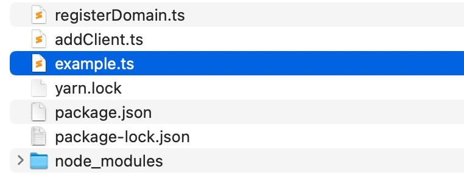

# JavaScript/TypeScript Guide

::: info

This guide targets `@iroha2/client` and `@iroha/data-model` version
**`^1.2`**.

This guide assumes you are familiar with Node.js and NPM ecosystem.

:::

## 1. Client Installation

The Iroha 2 JavaScript library consists of multiple packages:

| Package                                                   | Description                                                                                                                                        |
| --------------------------------------------------------- | -------------------------------------------------------------------------------------------------------------------------------------------------- |
| `client`                                                  | Submits requests to Iroha Peer                                                                                                                     |
| `data-model`                                              | Provides [SCALE](https://github.com/paritytech/parity-scale-codec) (Simple Concatenated Aggregate Little-Endian)-codecs for the Iroha 2 Data Model |
| `crypto-core`                                             | Contains cryptography types                                                                                                                        |
| `crypto-target-node`                                      | Provides compiled crypto WASM ([Web Assembly](https://webassembly.org/)) for the Node.js environment                                               |
| `crypto-target-web`                                       | Provides compiled crypto WASM for native Web (ESM)                                                                                                 |
| <code class="whitespace-pre">crypto-target-bundler</code> | Provides compiled crypto WASM to use with bundlers such as Webpack                                                                                 |

All of these are published under the `@iroha2` scope into Iroha Nexus
Registry. In the future, they will be published in the main NPM Registry.

::: info

You can also work with the sources in Iroha Javascript repository, where
the active development is happening. Clone the repository and check out the
`iroha2` branch:

```bash
git clone https://github.com/hyperledger/iroha-javascript.git --branch iroha2
```

Please note that this guide does not cover the details of this workflow.

:::

While we've taken great care to decouple the packages, so you could
minimise their footprint, for the purposes of this tutorial, it's better to
install everything.

The installation consists of two steps: setting up a registry and then
installing the packages you need.

1. Set up a registry. In shell, run:

   ```bash
   # FILE: .npmrc
   echo "@iroha2:registry=https://nexus.iroha.tech/repository/npm-group/" > .npmrc
   ```

2. Install Iroha 2 packages as any other NPM package. If you are following
   the tutorial, we recommend installing all of the following:

   ```bash
   npm i @iroha2/client
   npm i @iroha2/data-model
   npm i @iroha2/crypto-core
   npm i @iroha2/crypto-target-node
   npm i @iroha2/crypto-target-web
   npm i @iroha2/crypto-target-bundler
   ```

   ::: info

   Note that you can use other package managers, such as
   [yarn](https://yarnpkg.com) or [pnpm](https://pnpm.io), for a faster
   installation. For example:

   ```bash
   yarn add @iroha2/data-model
   pnpm add @iroha2/crypto-target-web
   ```

   :::

   The set of packages that you need to install depends on what you are
   trying to achieve. If you only need to play with the Data Model to
   perform (de-)serialisation, the `data-model` package is sufficient. If
   you need to check on a peer in terms of its status or health, then you
   only need the client library.

3. Install the following packages as well:

   ```bash
   npm i hada
   npm i tsx -g
   ```

4. If you are planning to use the Transaction or Query API, you'll also
   need to inject an appropriate `crypto` instance into the client at
   runtime. This has to be adjusted according to your particular
   environment.

   For example, Node.js users need the following:

   ```ts
   import { crypto } from '@iroha2/crypto-target-node'
   import { setCrypto } from '@iroha2/client'

   setCrypto(crypto)
   ```

   ::: info

   Please refer to the documentation of the respective
   `@iroha2/crypto-target-*` package, because each case has specific
   configuration steps. For example, the `web` target needs to be
   initialised (via asynchronous `init()`) before you can use any
   cryptographic methods.

   :::

   ```bash
   yarn add @iroha2/data-model
   pnpm add @iroha2/crypto-target-web
   ```

**Note**: when you are creating files in the following steps, you must
place them in the same directory that contains `node_modules`, like so:



Use `tsx` to run the scripts you've created. For example:

```bash
tsx example.ts
```

   The set of packages that you need to install depends on your intention.
   Maybe you only need to play with the Data Model to perform
   (de-)serialisation, in which case the `data-model` package is enough. If
   you only need to check on a peer in terms of its status or health, you
   just need the client library, because this API doesn't require any
   interactions with crypto or Data Model.

3. Install the following packages as well:

   ```bash
   npm i hada
   npm i tsx -g
   ```

4. If you are planning to use the Transaction or Query API, you'll also
   need to inject an appropriate `crypto` instance into the client at
   runtime. This has to be adjusted depending on your particular
   environment.

   For example, for Node.js users, such an injection may look like the
   following:

   ```ts
   import { crypto } from '@iroha2/crypto-target-node'
   import { setCrypto } from '@iroha2/client'

   setCrypto(crypto)
   ```

   ::: info

   Please refer to the related `@iroha2/crypto-target-*` package
   documentation because it may require some specific configuration. For
   example, the `web` target requires to call an asynchronous `init()`
   function before using `crypto`.

   :::

::: info

Note that when you are going to create files for the following steps in the
tutorial, you have to place them on the same level as the `node_modules`
directory:


Use `tsx` to run the scripts you've created. For example:

```bash
tsx example.ts
```

:::

## 2. Client Configuration

The JavaScript Client is fairly low-level in a sense that it doesn't expose
any convenience features like a `TransactionBuilder` or a `ConfigBuilder`.

::: info

The work on implementing those is underway, and these features will very
likely be available in the second round of this tutorial's release.

:::

Thus, on the plus side, configuration of the client is simple. On the
downside, you have to prepare a lot manually.

You may need to use transactions or queries, so before we initialize the
client, let's set up this part. Let's assume that you have stringified
public & private keys (more on that later). Thus, a key-pair generation
could look like this:

```ts
import { crypto } from '@iroha2/crypto-target-node'
import { KeyPair } from '@iroha2/crypto-core'

// the package for hex-bytes transform
import { hexToBytes } from 'hada'

function generateKeyPair(params: {
  publicKeyMultihash: string
  privateKey: {
    digestFunction: string
    payload: string
  }
}): KeyPair {
  const multihashBytes = Uint8Array.from(
    hexToBytes(params.publicKeyMultihash),
  )
  const multihash = crypto.createMultihashFromBytes(multihashBytes)
  const publicKey = crypto.createPublicKeyFromMultihash(multihash)
  const privateKey = crypto.createPrivateKeyFromJsKey(params.privateKey)

  const keyPair = crypto.createKeyPairFromKeys(publicKey, privateKey)

  // don't forget to "free" created structures
  for (const x of [publicKey, privateKey, multihash]) {
    x.free()
  }

  return keyPair
}

const kp = generateKeyPair({
  publicKeyMultihash:
    'ed0120e555d194e8822da35ac541ce9eec8b45058f4d294d9426ef97ba92698766f7d3',
  privateKey: {
    digestFunction: 'ed25519',
    payload:
      'de757bcb79f4c63e8fa0795edc26f86dfdba189b846e903d0b732bb644607720e555d194e8822da35ac541ce9eec8b45058f4d294d9426ef97ba92698766f7d3',
  },
})
```

A basic client setup requires a Torii configuration and an account ID. This
allows you to perform basic operations like health or status checks. As
described above, to use transactions or queries you'll need to have a
`keyPair` parameter as a part of the `Client` instance definition:

```ts
import { Client } from '@iroha2/client'

const client = new Client({
  torii: {
    // Both URLs are optional in case you only need one of them,
    // e.g. only the telemetry endpoints
    apiURL: 'http://127.0.0.1:8080',
    telemetryURL: 'http://127.0.0.1:8081',
  },
  accountId: AccountId({
    // Account name
    name: 'alice',
    // The domain where this account is registered
    domain_id: DomainId({
      name: 'wonderland',
    }),
  }),
  // A key pair, needed for transactions and queries
  keyPair: kp,
})
```

## 3. Registering a Domain

Here we see how similar the JavaScript code is to the Rust counterpart. It
should be emphasised that the JavaScript library is a thin wrapper: It
doesn't provide any special builder structures, meaning you have to work
with bare-bones compiled Data Model structures and define all internal
fields explicitly.

Doubly so, since JavaScript employs many implicit conversions, we highly
recommend that you employ TypeScript. This makes many errors far easier to
debug, but, unfortunately, results in more boilerplates.

Let's register a new domain named `looking_glass` using our current
account, _alice@wondeland_.

First, we need to import necessary models and a pre-configured client
instance:

```ts
import { Client } from '@iroha2/client'
import {
  DomainId,
  EvaluatesToRegistrableBox,
  Executable,
  Expression,
  IdentifiableBox,
  Instruction,
  MapNameValue,
  Metadata,
  NewDomain,
  OptionIpfsPath,
  QueryBox,
  RegisterBox,
  Value,
  VecInstruction,
} from '@iroha2/data-model'

// --snip--
declare const client: Client
```

To register a new domain, we need to submit a transaction with a single
instruction: to register a new domain. Let's wrap it all in an async
function:

```ts
async function registerDomain(domainName: string) {
  const registerBox = RegisterBox({
    object: EvaluatesToRegistrableBox({
      expression: Expression(
        'Raw',
        Value(
          'Identifiable',
          IdentifiableBox(
            'NewDomain',
            NewDomain({
              id: DomainId({
                name: domainName,
              }),
              metadata: Metadata({ map: MapNameValue(new Map()) }),
              logo: OptionIpfsPath('None'),
            }),
          ),
        ),
      ),
    }),
  })

  await client.submit(
    Executable(
      'Instructions',
      VecInstruction([Instruction('Register', registerBox)]),
    ),
  )
}
```

Which we use to register the domain like so:

```ts
await registerDomain('looking_glass')
```

We can also use Query API to ensure that the new domain is created. Let's
create another function that wraps that functionality:

```ts
async function ensureDomainExistence(domainName: string) {
  // Query all domains
  const result = await client.request(QueryBox('FindAllDomains', null))
  // Display the request status
  console.log('%o', result)

  // Obtain the domain
  const domain = result
    .as('Ok')
    .result.as('Vec')
    .map((x) => x.as('Identifiable').as('Domain'))
    .find((x) => x.id.name === domainName)
  // Throw an error if the domain is unavailable
  if (!domain) throw new Error('Not found')
}
```

Now you can ensure that domain is created by calling:

```ts
await ensureDomainExistence('looking_glass')
```

## 4. Registering an Account

Registering an account is a bit more involved than registering a domain.
With a domain, the only concern is the domain name. However, with an
account, there are a few more things to worry about.

First of all, we need to create an `AccountId`. Note that we can only
register an account to an existing domain. The best UX design practices
dictate that you should check if the requested domain exists _now_, and if
it doesn't, suggest a fix to the user. After that, we can create a new
account named _white_rabbit_.

Imports we need:

```ts
import {
  AccountId,
  DomainId,
  EvaluatesToRegistrableBox,
  Expression,
  IdentifiableBox,
  Instruction,
  MapNameValue,
  Metadata,
  NewAccount,
  PublicKey,
  RegisterBox,
  Value,
  VecPublicKey,
} from '@iroha2/data-model'
```

The `AccountId` structure:

```ts
const accountId = AccountId({
  name: 'white_rabbit',
  domain_id: DomainId({
    name: 'looking_glass',
  }),
})
```

Second, you should provide the account with a public key. It is tempting to
generate both it and the private key at this time, but it isn't the
brightest idea. Remember that _the white_rabbit_ trusts _you,
alice@wonderland,_ to create an account for them in the domain
_looking_glass_, **but doesn't want you to have access to that account
after creation**.

If you gave _white_rabbit_ a key that you generated yourself, how would
they know if you don't have a copy of their private key? Instead, the best
way is to **ask** _white_rabbit_ to generate a new key-pair, and give you
the public half of it.

```ts
const pubKey = PublicKey({
  payload: new Uint8Array([
    /* put bytes here */
  ]),
  digest_function: 'some_digest',
})
```

Only then do we build an instruction from it:

```ts
const registerAccountInstruction = Instruction(
  'Register',
  RegisterBox({
    object: EvaluatesToRegistrableBox({
      expression: Expression(
        'Raw',
        Value(
          'Identifiable',
          IdentifiableBox(
            'NewAccount',
            NewAccount({
              id: accountId,
              signatories: VecPublicKey([pubKey]),
              metadata: Metadata({ map: MapNameValue(new Map()) }),
            }),
          ),
        ),
      ),
    }),
  }),
)
```

Which is then wrapped in a transaction and submitted to the peer the same
way as in the previous section when we registered a domain.

## 5. Registering and minting assets

Now we must talk a little about assets. Iroha has been built with few
underlying assumptions about what the assets need to be.

The assets can be fungible (every £1 is exactly the same as every other
£1), or non-fungible (a £1 bill signed by the Queen of Hearts is not the
same as a £1 bill signed by the King of Spades), mintable (you can make
more of them) and non-mintable (you can only specify their initial quantity
in the genesis block).

Additionally, the assets have different underlying value types.
Specifically, we have `AssetValueType.Quantity`, which is effectively an
unsigned 32-bit integer, a `BigQuantity`, which is an unsigned 128-bit
integer, and `Fixed`, which is a positive (though signed) 64-bit
fixed-precision number with nine significant digits after the decimal
point. All three types can be registered as either **mintable** or
**non-mintable**.

In JS, you can create a new asset with the following construction:

```ts
import {
  NewAssetDefinition,
  AssetDefinitionId,
  AssetValueType,
  DomainId,
  EvaluatesToRegistrableBox,
  Expression,
  IdentifiableBox,
  Instruction,
  MapNameValue,
  Metadata,
  Mintable,
  RegisterBox,
  Value,
} from '@iroha2/data-model'

const newTimeAsset = NewAssetDefinition({
  value_type: AssetValueType('Quantity'),
  id: AssetDefinitionId({
    name: 'time',
    domain_id: DomainId({ name: 'looking_glass' }),
  }),
  metadata: Metadata({ map: MapNameValue(new Map()) }),
  mintable: Mintable('Not'), // If only we could mint more time.
})

const register = Instruction(
  'Register',
  RegisterBox({
    object: EvaluatesToRegistrableBox({
      expression: Expression(
        'Raw',
        Value(
          'Identifiable',
          IdentifiableBox('NewAssetDefinition', newTimeAsset),
        ),
      ),
    }),
  }),
)
```

Pay attention to the fact that we have defined the asset as
`Mintable('Not')`. What this means is that we cannot create more of `time`.
The late bunny will always be late, because even the super-user of the
blockchain cannot mint more of `time` than already exists in the genesis
block.

This means that no matter how hard the _white_rabbit_ tries, the time that
he has is the time that was given to him at genesis. And since we haven't
defined any time in the domain _looking_glass_ at genesis and defined time
in a non-mintable fashion afterwards, the _white_rabbit_ is doomed to
always be late.

If we had set `mintable: Mintable('Infinitely')` on our time asset, we
could mint it:

```ts
import {
  AssetDefinitionId,
  DomainId,
  EvaluatesToIdBox,
  EvaluatesToValue,
  Expression,
  IdBox,
  AssetId,
  AccountId,
  Instruction,
  MintBox,
  Value,
} from '@iroha2/data-model'

const mint = Instruction(
  'Mint',
  MintBox({
    object: EvaluatesToValue({
      expression: Expression('Raw', Value('U32', 42)),
    }),
    destination_id: EvaluatesToIdBox({
      expression: Expression(
        'Raw',
        Value(
          'Id',
          IdBox(
            'AssetId',
            AssetId({
              account_id: AccountId({
                name: 'alice',
                domain_id: DomainId({
                  name: 'wonderland',
                }),
              }),
              definition_id: AssetDefinitionId({
                name: 'time',
                domain_id: DomainId({ name: 'looking_glass' }),
              }),
            }),
          ),
        ),
      ),
    }),
  }),
)
```

Again it should be emphasised that an Iroha 2 network is strongly typed.
You need to take special care to make sure that only unsigned integers are
passed to the `Value.variantsUnwrapped.U32` factory method. Fixed precision
values also need to be taken into consideration. Any attempt to add to or
subtract from a negative Fixed-precision value will result in an error.

## 6. Visualizing outputs

Finally, we should talk about visualising data. The Rust API is currently
the most complete in terms of available queries and instructions. After
all, this is the language in which Iroha 2 was built.

Let's build a small Vue 3 application that uses each API we've discovered
in this guide!

Our app will consist of 3 main views:

- Status checker that periodically requests peer status (e.g. current
  blocks height) and shows it;
- Domain creator, which is a form to create a new domain with specified
  name;
- Listener with a toggle to setup listening for events.

Our client config is the following (`config.json` file in the project):

```json
{
  "torii": {
    "apiURL": "http://127.0.0.1:8080",
    "telemetryURL": "http://127.0.0.1:8081"
  },
  "account": {
    "name": "alice",
    "domain_id": {
      "name": "wonderland"
    }
  },
  "publicKey": "ed01207233bfc89dcbd68c19fde6ce6158225298ec1131b6a130d1aeb454c1ab5183c0",
  "privateKey": {
    "digestFunction": "ed25519",
    "payload": "9ac47abf59b356e0bd7dcbbbb4dec080e302156a48ca907e47cb6aea1d32719e7233bfc89dcbd68c19fde6ce6158225298ec1131b6a130d1aeb454c1ab5183c0"
  }
}
```

To use these, firstly, we need to initialize our client and crypto.

```ts
// FILE: crypto.ts

import { init, crypto } from '@iroha2/crypto-target-web'

// using top-level module await
await init()

export { crypto }
```

```ts
// FILE: client.ts

import { Client, setCrypto } from '@iroha2/client'
import { KeyPair } from '@iroha2/crypto-core'
import { hexToBytes } from 'hada'
import { AccountId } from '@iroha2/data-model'

// importing already initialized crypto
import { crypto } from './crypto'

// a config with stringified keys
import client_config from './config'

setCrypto(crypto)

export const client = new Client({
  torii: {
    // these ports are specified in the peer's own config
    apiURL: `http://localhost:8080`,
    telemetryURL: `http://localhost:8081`,
  },
  // Account name and the domain where it's registered
  accountId: client_config.account as AccountId,
  // A key pair, required for the account authentication
  keyPair: generateKeyPair({
    publicKeyMultihash: client_config.publicKey,
    privateKey: client_config.privateKey,
  }),
})

// an util function
function generateKeyPair(params: {
  publicKeyMultihash: string
  privateKey: {
    digestFunction: string
    payload: string
  }
}): KeyPair {
  const multihashBytes = Uint8Array.from(
    hexToBytes(params.publicKeyMultihash),
  )
  const multihash = crypto.createMultihashFromBytes(multihashBytes)
  const publicKey = crypto.createPublicKeyFromMultihash(multihash)
  const privateKey = crypto.createPrivateKeyFromJsKey(params.privateKey)

  const keyPair = crypto.createKeyPairFromKeys(publicKey, privateKey)

  for (const x of [publicKey, privateKey, multihash]) {
    x.free()
  }

  return keyPair
}
```

Now we are ready to use the client. Let's start from the `StatusChecker`
component:

```vue
<script setup lang="ts">
import { useIntervalFn, useAsyncState } from '@vueuse/core'
import { client } from '../client'

const { state: status, execute: updateStatus } = useAsyncState(
  () => client.getStatus(),
  null,
  {
    resetOnExecute: false,
  },
)

useIntervalFn(() => updateStatus(), 1000)
</script>

<template>
  <div>
    <h3>Status</h3>

    <ul v-if="status">
      <li>Blocks: {{ status.blocks }}</li>
      <li>Uptime (sec): {{ status.uptime.secs }}</li>
    </ul>
  </div>
</template>
```

Now let's build the `CreateDomain` component:

```vue
<script setup lang="ts">
import {
  DomainId,
  EvaluatesToRegistrableBox,
  Executable,
  Expression,
  IdentifiableBox,
  Instruction,
  MapNameValue,
  Metadata,
  NewDomain,
  OptionIpfsPath,
  RegisterBox,
  Value,
  VecInstruction,
} from '@iroha2/data-model'
import { ref } from 'vue'
import { client } from '../client'

const domainName = ref('')
const isPending = ref(false)

async function register() {
  try {
    isPending.value = true

    await client.submit(
      Executable(
        'Instructions',
        VecInstruction([
          Instruction(
            'Register',
            RegisterBox({
              object: EvaluatesToRegistrableBox({
                expression: Expression(
                  'Raw',
                  Value(
                    'Identifiable',
                    IdentifiableBox(
                      'NewDomain',
                      NewDomain({
                        id: DomainId({
                          name: domainName.value,
                        }),
                        metadata: Metadata({
                          map: MapNameValue(new Map()),
                        }),
                        logo: OptionIpfsPath('None'),
                      }),
                    ),
                  ),
                ),
              }),
            }),
          ),
        ]),
      ),
    )
  } finally {
    isPending.value = false
  }
}
</script>

<template>
  <div>
    <h3>Create Domain</h3>
    <p>
      <label for="domain">New domain name:</label>
      <input id="domain" v-model="domainName" />
    </p>
    <p>
      <button @click="register">
        Register domain{{ isPending ? '...' : '' }}
      </button>
    </p>
  </div>
</template>
```

And finally, let's build the `Listener` component that will use Events API
to set up a live connection with a peer:

```vue
<script setup lang="ts">
import { SetupEventsReturn } from '@iroha2/client'
import {
  FilterBox,
  OptionHash,
  OptionPipelineEntityKind,
  OptionPipelineStatusKind,
  PipelineEntityKind,
  PipelineEventFilter,
  PipelineStatusKind,
} from '@iroha2/data-model'
import {
  computed,
  onBeforeUnmount,
  shallowReactive,
  shallowRef,
} from 'vue'
import { bytesToHex } from 'hada'
import { client } from '../client'

interface EventData {
  hash: string
  status: string
}

const events = shallowReactive<EventData[]>([])

const currentListener = shallowRef<null | SetupEventsReturn>(null)

const isListening = computed(() => !!currentListener.value)

async function startListening() {
  currentListener.value = await client.listenForEvents({
    filter: FilterBox(
      'Pipeline',
      PipelineEventFilter({
        entity_kind: OptionPipelineEntityKind(
          'Some',
          PipelineEntityKind('Transaction'),
        ),
        status_kind: OptionPipelineStatusKind(
          'Some',
          PipelineStatusKind('Committed'),
        ),
        hash: OptionHash('None'),
      }),
    ),
  })

  currentListener.value.ee.on('event', (event) => {
    const { hash, status } = event.as('Pipeline')
    events.push({
      hash: bytesToHex([...hash]),
      status: status.match({
        Validating: () => 'validating',
        Committed: () => 'committed',
        Rejected: (_reason) => 'rejected with some reason',
      }),
    })
  })
}

async function stopListening() {
  await currentListener.value?.stop()
  currentListener.value = null
}

onBeforeUnmount(stopListening)
</script>

<template>
  <div>
    <h3>Listening</h3>

    <p>
      <button @click="isListening ? stopListening() : startListening()">
        {{ isListening ? 'Stop' : 'Listen' }}
      </button>
    </p>

    <p>Events:</p>

    <ul>
      <li v-for="{ hash, status } in events" :key="hash">
        Transaction <code>{{ hash }}</code> status:
        {{ status }}
      </li>
    </ul>
  </div>
</template>
```

That's it! Finally, we just need to wrap it up with the `App.vue` component
and the `app` entrypoint:

```vue
<script setup lang="ts">
import CreateDomain from './components/CreateDomain.vue'
import Listener from './components/Listener.vue'
import StatusChecker from './components/StatusChecker.vue'
</script>

<template>
  <StatusChecker />
  <hr />
  <CreateDomain />
  <hr />
  <Listener />
</template>

<style lang="scss">
#app {
  padding: 16px;
  font-family: sans-serif;
}
</style>
```

```ts
// main.ts

import { createApp } from 'vue'
import App from './App.vue'

createApp(App).mount('#app')
```

Here is a small demo with the usage of this component:

<div class="border border-solid border-gray-300 rounded-md shadow-md">


</div>
