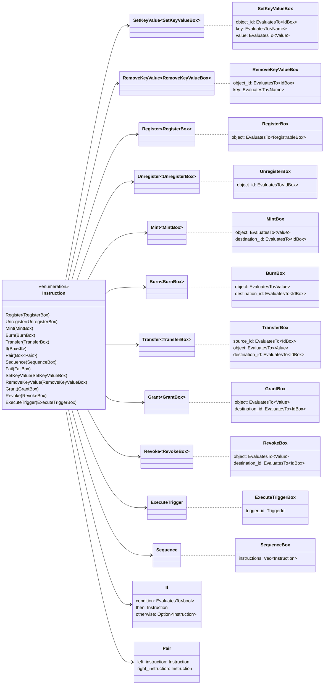

# Iroha Special Instructions

<!-- TODO: move reference content from the guide part -->

The following instructions are supported in Iroha 2:

|                                       Instruction                                       |                   Descriptions                    |
| --------------------------------------------------------------------------------------- | ------------------------------------------------- |
| [Register/Unregister](/blockchain/instructions#un-register)                       | Give an ID to a new entity on the blockchain.     |
| [Mint/Burn](/blockchain/instructions#mint-burn)                                   | Mint/burn assets, triggers, or permission tokens. |
| [SetKeyValue/RemoveKeyValue](/blockchain/instructions#setkeyvalue-removekeyvalue) | Update blockchain object metadata.                |
| [NewParameter/SetParameter](/blockchain/instructions#newparameter-setparameter)   | Create/set a chain-wide config parameter.         |
| [Grant/Revoke](/blockchain/instructions#grant-revoke)                             | Give or remove certain permissions from accounts. |
| [Transfer](/blockchain/instructions#transfer)                                     | Transfer assets between accounts.                 |
| [ExecuteTrigger](/blockchain/instructions#executetrigger)                         | Execute triggers.                                 |
| [If, Pair, Sequence](/blockchain/instructions#composite-instructions)             | Use to create composite instructions.             |

::: details Diagram: Iroha Special Instructions

:::